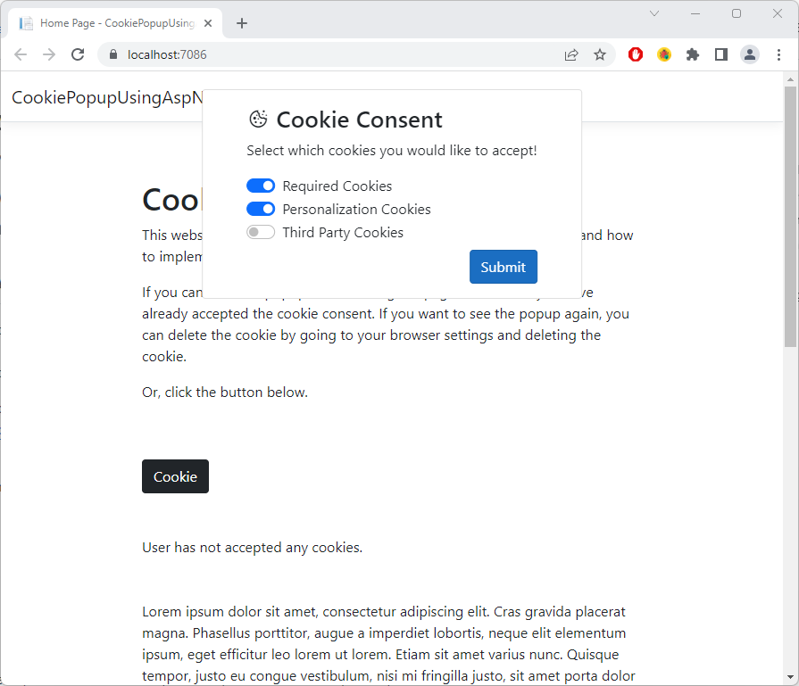
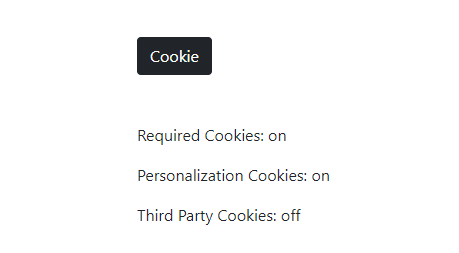

# CookiePopupUsingAspNet

A simple cookie popup message using ASP.NET and Bootstrap for the frontend. The cookie popup message is shown as an overlay to the content of the page, only rendered if the cookie does not exist on the users browser. In a single, encrypted cookie, it stores if the user has accepted three cookie options. These selections are then shown on the webpage once the user has accepted the cookie popup message. 
 

The following screenshot shows the cookie popup message:

 

 

The following screenshot shows the webpage telling the user which cookies they have accepted:

 

